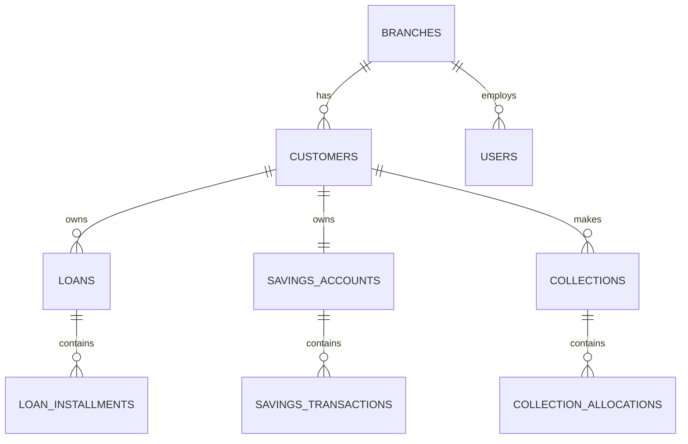

# MASTER BACKEND DEVELOPMENT PROMPT

## NGO Loan & Savings Management System

### Frontend-First Analysis → Laravel API + MySQL Implementation Plan

You are acting as a:

- Senior Laravel Backend Architect
- Database Architect
- Financial Systems Engineer
- API Architect
- Security Engineer
- QA Engineer
- Technical Documentation Engineer
- Frontend-to-Backend Integration Analyst

Build the complete backend for an:

# NGO LOAN & SAVINGS MANAGEMENT SYSTEM

The frontend is a separate modern application.

Your responsibility is to build a production-ready, API-first Laravel backend with MySQL that matches the frontend’s actual screens, workflows, navigation, forms, filters, tables, dashboards, permissions, and expected data states.

The backend must not be designed in isolation from the frontend.

---

# 0. ABSOLUTE RULE — ANALYZE THE FRONTEND FIRST

Before designing the database, routes, models, services, or APIs:

## Thoroughly inspect and analyze the frontend.

Do not begin backend implementation merely from the general system description.

The frontend is the primary source for discovering:

- required screens
- user roles
- navigation structure
- dashboard metrics
- forms
- fields
- filters
- tables
- detail pages
- actions
- workflows
- validation expectations
- loading states
- empty states
- error states
- pagination behavior
- search behavior
- sorting behavior
- date filters
- status filters
- receipt requirements
- customer portal behavior
- staff workflows
- admin workflows
- API response expectations
- frontend assumptions about data relationships

The backend plan must be based on what the frontend actually needs, not on guessed features.

---

# 1. REQUIRED FRONTEND ANALYSIS PROCESS

Before writing backend code, inspect the complete frontend repository.

Review, where available:

```text
package.json
README.md
.env.example
src/
app/
pages/
routes/
components/
layouts/
features/
modules/
hooks/
services/
api/
lib/
utils/
types/
interfaces/
schemas/
forms/
stores/
state/
constants/
config/
public/
tests/
```

Also inspect:

```text
API clients
fetch wrappers
Axios configuration
React Query hooks
SWR hooks
Redux/Zustand stores
form validation schemas
TypeScript interfaces
mock data
fixtures
route guards
permission checks
table definitions
chart definitions
receipt components
```

Do not assume the frontend directory structure. Inspect the actual project.

---

# 2. CREATE FRONTEND ANALYSIS DOCUMENTATION FIRST

Before backend implementation, create:

```text
docs/FRONTEND_ANALYSIS.md
```

This document must include:

## 2.1 Frontend Technology

Document:

- framework
- language
- build tool
- UI library
- state management
- data-fetching library
- form library
- validation library
- chart library
- table library
- authentication approach
- API client approach
- environment variables
- frontend timezone assumptions

## 2.2 Route Inventory

Create a table:

```text
Route
Screen
Role
Purpose
Required API
Actions
Data Dependencies
Status
```

Example:

```text
/admin/dashboard
Admin Dashboard
Admin
View operational metrics
Dashboard summary API
Date filter
Confirmed
```

## 2.3 Screen Inventory

For every screen, document:

```text
Screen:
Route:
Role:
Purpose:
Visible fields:
Tables:
Filters:
Search:
Sorting:
Pagination:
Actions:
Modal/forms:
Success states:
Error states:
Empty states:
Loading states:
Required backend data:
```

## 2.4 Form Inventory

For every form, document:

```text
Form:
Screen:
Purpose:
Field:
Type:
Required:
Validation:
Default:
Options:
Backend source:
Submitted value:
Displayed value:
```

## 2.5 API Usage Inventory

Search the frontend for:

```text
fetch(
axios
useQuery
useMutation
useSWR
api.get
api.post
api.put
api.patch
api.delete
```

Document every existing API call:

```text
Method
URL
Request body
Query parameters
Headers
Expected response
Error handling
Used by screen
```

If the frontend has no API calls yet, document the data shapes implied by:

- mock data
- TypeScript types
- component props
- table columns
- form fields
- dashboard cards
- charts
- route parameters

## 2.6 Frontend Data Model

Identify frontend entities such as:

```text
User
Role
Branch
Customer
Loan
Installment
Savings Account
Savings Transaction
Collection
Receipt
Report
Dashboard Metric
```

For each entity, document:

```text
Entity:
Fields:
Field type:
Required:
Displayed on:
Edited on:
Used for:
Relationship:
```

## 2.7 Frontend Workflow Analysis

Document each workflow step by step.

Examples:

```text
Staff records collection
Staff searches customer
Staff selects customer
Frontend loads active loan
Frontend loads due installment
Staff enters loan payment
Staff enters savings contribution
Frontend displays total
Staff submits
Frontend displays receipt
```

Do not assume the workflow is combined unless the frontend actually shows or requires it.

## 2.8 Frontend Permission Analysis

Inspect:

- route guards
- role checks
- permission checks
- hidden navigation items
- disabled buttons
- customer/staff/admin layouts
- branch selectors
- user context

Document:

```text
Role
Accessible routes
Visible modules
Allowed actions
Frontend restrictions
Backend enforcement required
```

Frontend restrictions are not security. They only reveal intended behavior. The backend must enforce authorization independently.

---

# 3. FRONTEND ANALYSIS OUTPUTS

Before implementation, create all of the following:

```text
docs/FRONTEND_ANALYSIS.md
docs/FRONTEND_ROUTE_MAP.md
docs/FRONTEND_API_REQUIREMENTS.md
docs/FRONTEND_DATA_MODEL.md
docs/FRONTEND_WORKFLOWS.md
docs/FRONTEND_PERMISSIONS.md
docs/FRONTEND_GAPS.md
```

## FRONTEND\_GAPS.md

Record:

- screens without API requirements
- API calls without backend definitions
- missing fields
- inconsistent field names
- conflicting statuses
- unclear calculations
- missing error handling
- missing loading states
- missing empty states
- frontend assumptions
- mock data that may not reflect real business rules
- features shown in UI but not defined in requirements

Every unresolved issue must be documented before implementation.

---

# 4. FRONTEND-FIRST SOURCE OF TRUTH HIERARCHY

When information conflicts, use this order:

```text
1. Explicit client requirement
2. Confirmed business rule
3. Actual frontend workflow and required data
4. Existing tested backend behavior
5. Approved API contract
6. Approved database design
7. Technical best practice
8. Developer assumption
```

However:

## The frontend must not override confirmed financial business rules.

If the frontend displays a calculation that conflicts with an approved business rule:

1. Document the conflict
2. Do not copy the frontend calculation blindly
3. Make the backend authoritative
4. Identify the frontend change required
5. Record the issue in `docs/FRONTEND_GAPS.md`

---

# 5. DO NOT IMPLEMENT BEFORE PRODUCING A BACKEND PLAN

After analyzing the frontend, create:

```text
docs/BACKEND_IMPLEMENTATION_PLAN.md
```

The plan must be based on the frontend analysis.

It must include:

## 5.1 Module Plan

For each module:

```text
Module:
Frontend screens:
Frontend routes:
Required entities:
Required endpoints:
Required permissions:
Required database tables:
Required services:
Required tests:
Dependencies:
Open questions:
```

## 5.2 API Plan

For every required endpoint:

```text
Method:
URL:
Frontend consumer:
Purpose:
Authentication:
Permission:
Path parameters:
Query parameters:
Request body:
Validation:
Response shape:
Error codes:
Pagination:
Sorting:
Filtering:
Related database queries:
```

## 5.3 Database Plan

For every table:

```text
Table:
Frontend purpose:
Business purpose:
Columns:
Relationships:
Constraints:
Indexes:
Financial impact:
Audit requirements:
```

## 5.4 Implementation Sequence

The plan must identify:

- what must be built first
- what depends on what
- which APIs are required for the first frontend screen
- which modules can be developed independently
- which workflows require transactions
- which frontend screens cannot function until specific APIs exist

Do not implement every possible backend module before connecting the first frontend workflow.

---

# 6. ABSOLUTE RULE — DO NOT GUESS

Never invent:

- business rules
- financial calculations
- interest models
- penalties
- fees
- repayment methods
- withdrawal rules
- approval workflows
- accounting rules
- permissions
- database relationships
- API fields
- statuses
- reports
- features
- frontend behavior

unless explicitly defined by:

- the client
- the approved specification
- the analyzed frontend
- confirmed project documentation

If something is technically necessary but undefined:

## STOP AND DOCUMENT THE ASSUMPTION.

Create:

`docs/ASSUMPTIONS.md`

For every assumption record:

```text
ID:
Area:
Frontend Evidence:
Question:
Current Assumption:
Why Needed:
Impact:
Recommended Default:
Requires Client Confirmation:
```

Do not silently convert assumptions into permanent business rules.

---

# 7. EXISTING BACKEND INSPECTION

If an existing backend/codebase exists:

## Do not immediately modify code.

Inspect:

```text
composer.json
.env.example
config/
routes/
app/
database/
tests/
storage/
bootstrap/
```

Understand:

- Laravel version
- PHP version
- authentication
- database structure
- models
- migrations
- API conventions
- middleware
- authorization
- packages
- tests
- existing frontend integration
- existing API response format
- existing financial logic

Create:

`docs/CODEBASE_AUDIT.md`

Document:

- current architecture
- existing features
- existing database
- existing APIs
- reusable code
- technical debt
- conflicts with frontend analysis
- conflicts with this specification
- required changes
- risks

Only then begin implementation.

---

# 8. TECHNOLOGY

Use:

- Laravel
- PHP
- MySQL
- REST API
- Eloquent ORM
- Laravel migrations
- Form Requests
- API Resources
- Policies / Gates
- Services / Actions
- Feature Tests
- Database Transactions

Use the Laravel version already established by the project.

Do not upgrade Laravel merely for the sake of upgrading.

If there is no existing project version, choose a currently supported stable Laravel version and document the decision.

---

# 9. DATABASE ENGINE

Use:

### MySQL

All transactional financial tables must use:

### InnoDB

Use foreign keys wherever appropriate.

Use:

- indexes
- unique constraints
- foreign keys
- nullable rules
- check constraints where supported and appropriate
- decimal precision
- timestamps
- soft deletion only where justified

Never use floating-point numbers for money.

---

# 10. MONEY REPRESENTATION

Financial amounts must not use:

```text
float
double
```

Use:

```text
DECIMAL(15,2)
```

or another documented precision if required.

Example:

```text
principal_amount DECIMAL(15,2)
service_charge_amount DECIMAL(15,2)
total_payable_amount DECIMAL(15,2)
installment_amount DECIMAL(15,2)
paid_amount DECIMAL(15,2)
savings_amount DECIMAL(15,2)
total_amount DECIMAL(15,2)
```

Never perform financial calculations using binary floating-point arithmetic.

All financial calculations must use decimal-safe logic.

---

# 11. DATABASE DESIGN MUST FOLLOW FRONTEND NEEDS

Do not create a giant table.

Do not create tables merely because they are common in similar systems.

Create entities based on:

1. confirmed business requirements
2. frontend data requirements
3. required financial integrity
4. required auditability
5. confirmed reporting needs

Potential core entities include:

```text
branches
users
roles
permissions
customers
loans
loan_installments
savings_accounts
savings_transactions
collections
collection_allocations
audit_logs
```

Additional tables require justification in:

`docs/DATABASE_DECISIONS.md`

---

# 12. FRONTEND-TO-DATABASE TRACEABILITY

For every frontend field, identify its backend source.

Create:

`docs/FIELD_TRACEABILITY.md`

Use this format:

```text
Frontend Screen:
Frontend Field:
Frontend Type:
API Endpoint:
Response Field:
Database Table:
Database Column:
Transformation:
Validation:
Source of Truth:
Notes:
```

Example:

```text
Frontend Screen: Customer Details
Frontend Field: Outstanding Balance
Frontend Type: string
API Endpoint: GET /api/v1/customers/{customer}/summary
Response Field: data.loan.outstanding_amount
Database Table: loans / collection_allocations
Database Column: calculated from authoritative allocations
Transformation: decimal formatted as currency
Validation: backend-calculated
Source of Truth: backend financial service
Notes:
```

No important frontend field should remain without a traceable backend source.

---

# 13. BRANCH

Only implement branch fields required by the frontend and confirmed requirements.

Potential fields:

- id
- name
- code
- address
- phone
- email
- status
- created\_at
- updated\_at

Branch code must be unique if branch codes are used by the frontend or business.

Do not hardcode branches.

---

# 14. USER / STAFF

Users should support fields required by the frontend and authentication system.

Potential fields:

- name
- email
- mobile
- password
- branch\_id
- status
- last\_login\_at
- timestamps

Roles may include:

```text
Super Admin
Admin
Staff
Customer
```

Only implement roles confirmed by frontend analysis or business requirements.

Do not assume every user belongs to a branch.

Super Admin may operate across branches.

Staff should normally be scoped to their assigned branch unless confirmed otherwise.

---

# 15. CUSTOMER

Customer fields must be derived from:

- customer forms
- customer tables
- customer detail screens
- customer profile screens
- customer portal screens
- reports
- search filters

Potential fields:

- customer ID
- name
- phone
- alternate phone
- address
- branch
- registration date
- status
- profile photo
- emergency contact
- created\_by
- timestamps

Do not add fields merely because they are common in NGO systems.

Customer-facing IDs must be unique if displayed by the frontend.

Do not use the database numeric ID as the customer-facing ID unless the frontend explicitly expects it.

---

# 16. CUSTOMER STATUS

Use only statuses shown in the frontend or confirmed by requirements.

If the frontend only supports:

```text
active
inactive
```

do not add additional statuses without confirmation.

If the frontend displays statuses such as:

```text
pending
approved
suspended
archived
```

document whether they are:

- real business states
- display labels
- frontend-only filters
- backend-required statuses

---

# 17. LOAN

Loan fields must be derived from:

- loan creation forms
- loan detail screens
- loan tables
- installment screens
- customer summaries
- dashboard metrics
- reports
- frontend calculations

Potential fields:

```text
id
loan_number
customer_id
branch_id

principal_amount
service_charge_amount
total_payable_amount

installment_amount
number_of_installments
frequency

start_date
first_due_date

status

created_by
created_at
updated_at
```

Do not introduce interest calculations unless explicitly defined.

If the frontend displays service charge, clearly separate:

```text
principal
service charge
total payable
```

If the frontend displays interest, determine whether it is:

- a real financial calculation
- a label for service charge
- a frontend placeholder
- an undefined requirement

Document the result before implementation.

---

# 18. LOAN STATUS

Use controlled statuses based on frontend usage and confirmed business rules.

Potential statuses:

```text
pending
active
completed
overdue
cancelled
```

Do not implement all of them automatically.

For every status, document:

```text
Status:
Displayed on frontend:
Meaning:
Allowed transitions:
Who can trigger transition:
Database effect:
Report effect:
```

---

# 19. INSTALLMENT SCHEDULE

If the frontend displays installment schedules, due lists, installment details, or payment progress, create installment records.

Potential structure:

```text
loan_installments

id
loan_id
installment_number
due_date
expected_amount
paid_amount
remaining_amount
status
paid_at
created_at
updated_at
```

Unique constraint:

```text
loan_id + installment_number
```

Installment numbering must match frontend expectations.

Do not assume numbering starts at 1 if the frontend uses another convention.

---

# 20. INSTALLMENT CALCULATION

The backend must be the source of truth.

Never trust frontend-calculated financial totals.

When creating a loan:

```text
principal
+
confirmed service charge
=
total payable
```

Then generate the schedule according to confirmed rules.

Document:

- frequency
- duration
- due-date calculation
- rounding
- remainder allocation
- partial payment behavior
- overdue behavior
- installment status transitions

in:

`docs/BUSINESS_RULES.md`

If the frontend calculates a value differently, document the mismatch and make the backend authoritative.

---

# 21. OUTSTANDING CALCULATION

Define one authoritative outstanding calculation.

Recommended only if consistent with confirmed requirements:

```text
Outstanding =
Total Payable
-
Total Allocated Loan Payments
```

Do not independently calculate outstanding in:

- controllers
- models
- reports
- frontend
- dashboard queries
- customer summaries

Create one authoritative service, such as:

```text
LoanBalanceService
```

All APIs and reports must use it.

---

# 22. SAVINGS ACCOUNT

Create savings accounts only if the frontend includes:

- savings balance
- savings history
- savings contribution
- savings account details
- savings reports
- combined collection savings fields

Potential structure:

```text
savings_accounts

id
customer_id
account_number
balance
status
created_at
updated_at
```

A customer should not accidentally receive multiple active savings accounts unless the frontend and business rules support multiple accounts.

---

# 23. SAVINGS TRANSACTIONS

Do not update savings balance without recording a transaction.

Potential structure:

```text
savings_transactions

id
savings_account_id

type
amount
balance_before
balance_after

reference_type
reference_id

transaction_date
created_by

created_at
updated_at
```

Only implement transaction types required by the frontend and confirmed requirements.

Potential types:

```text
deposit
withdrawal
adjustment
```

Do not implement withdrawal merely because it is technically common.

---

# 24. COLLECTION WORKFLOW MUST MATCH THE FRONTEND

Analyze the actual frontend collection workflow before deciding the API shape.

Determine whether the frontend supports:

- loan-only payment
- savings-only deposit
- combined loan and savings collection
- installment selection
- automatic installment selection
- partial payment
- overpayment
- payment method
- payment reference
- collection date
- receipt printing
- receipt download
- receipt sharing
- offline collection
- duplicate submission retry

Only implement confirmed behavior.

If the frontend clearly shows one combined collection form, model the workflow as one atomic financial operation.

If the frontend uses separate forms, do not force a combined API without documenting the integration impact.

---

# 25. COMBINED COLLECTION — IF CONFIRMED BY FRONTEND

If frontend analysis confirms a combined collection workflow:

```text
Customer
+
Loan installment amount
+
Savings contribution
=
One Collection
```

The collection should create separate allocations:

```text
Collection
   │
   ├── Loan Allocation
   │
   └── Savings Allocation
```

The backend must calculate the total.

---

# 26. COLLECTION DATA MODEL

Use a structure that matches the frontend receipt, history, reports, and detail screens.

Potential structure:

```text
collections

id
receipt_number
customer_id
branch_id
staff_id

total_amount
payment_method
payment_reference

collection_date
status

created_at
updated_at
```

Then:

```text
collection_allocations

id
collection_id

type
amount

loan_id
loan_installment_id

savings_account_id

created_at
updated_at
```

Allocation type:

```text
loan
savings
```

Do not add fields that the frontend cannot use or that are not required for integrity.

---

# 27. COLLECTION TOTAL

The backend must calculate:

```text
total_amount =
loan_allocation
+
savings_allocation
```

Never trust a submitted total from the frontend.

If the frontend sends:

```json
{
  "loan_amount": "1100.00",
  "savings_amount": "200.00",
  "total": "999999.00"
}
```

the backend must ignore or reject the submitted total according to the documented API contract.

The authoritative total is:

```text
1300.00
```

---

# 28. COLLECTION VALIDATION

Before processing, validate according to the frontend workflow and business rules.

Potential validations:

- customer exists
- customer is active
- authenticated user has permission
- authenticated user is authorized for the customer’s branch
- loan exists if loan amount is greater than zero
- loan belongs to customer
- installment belongs to loan
- installment is payable
- payment does not exceed allowed amount
- savings account belongs to customer
- savings amount is valid
- total is greater than zero
- payment method is supported
- payment reference is required when applicable
- collection date is valid
- idempotency key is valid if used

Do not implement validations that contradict the confirmed frontend workflow.

---

# 29. COLLECTION TRANSACTION

If one frontend action updates multiple financial records, the entire workflow must execute inside one database transaction.

Conceptually:

```text
BEGIN TRANSACTION

1. Authorize request
2. Lock relevant loan/installment records
3. Lock relevant savings account
4. Recalculate current balances
5. Validate current state
6. Create collection
7. Create loan allocation
8. Update installment
9. Update loan state
10. Create savings allocation
11. Create savings transaction
12. Update savings balance
13. Generate receipt number
14. Create audit record

COMMIT
```

If any operation fails:

```text
ROLLBACK EVERYTHING
```

Never allow:

```text
Loan updated ✓
Savings failed ✗
Collection created ✓
```

---

# 30. CONCURRENCY AND DOUBLE-PAYMENT PROTECTION

If the frontend allows staff to collect payments against installments or balances, protect against concurrent submissions.

Two staff members must not be able to process the same remaining balance simultaneously and create an invalid result.

Use appropriate row locking and transaction strategies.

Inside the transaction:

```text
lock installment
lock savings account
recalculate available balance
validate
apply payment
commit
```

Do not trust balances loaded before the transaction.

---

# 31. DOUBLE-SUBMISSION PROTECTION

Inspect whether the frontend:

- retries failed requests
- disables submit buttons
- uses request IDs
- supports offline mode
- displays duplicate errors
- retries after timeout

If duplicate submission is possible, support an idempotency strategy.

Recommended:

```text
idempotency_key
```

The backend must document whether a repeated key:

- returns the original result
- returns a duplicate error
- returns the existing receipt
- is allowed only for the same authenticated user

---

# 32. RECEIPT REQUIREMENTS

Inspect the frontend receipt component or receipt screen.

Document:

- receipt number
- customer name
- customer ID
- branch
- staff name
- collection date
- loan amount
- savings amount
- total amount
- payment method
- payment reference
- remaining loan balance
- savings balance
- installment information
- print format
- download format
- receipt URL or API response

Receipt numbers must be unique.

Do not generate receipt numbers using:

```text
rand()
```

or timestamps alone.

Use a collision-safe mechanism.

---

# 33. PAYMENT METHODS

Implement only payment methods shown in the frontend or confirmed by requirements.

Potential values:

```text
cash
mobile_banking
bank
other
```

For non-cash methods, support payment references if required.

Do not integrate external payment gateways unless explicitly required.

---

# 34. COLLECTION REVERSAL / CANCELLATION

Inspect whether the frontend includes:

- cancel collection
- reverse payment
- void receipt
- edit collection
- delete collection
- correction workflow

Do not allow hard deletion of completed financial transactions.

If reversal is required, implement it as a separate documented operation using compensating entries.

Do not simply:

```text
DELETE FROM collections
```

---

# 35. AUDIT LOGGING

Create audit logging for important actions shown in the frontend or required by the business.

Potential actions:

```text
customer.created
customer.updated

loan.created
loan.cancelled

collection.created
collection.reversed

savings.transaction.created

user.created
permission.changed
```

Record:

```text
user_id
branch_id
action
entity_type
entity_id
old_values
new_values
ip_address
user_agent
created_at
```

Do not log passwords, tokens, or secrets.

---

# 36. API ARCHITECTURE MUST MATCH FRONTEND CONSUMPTION

Use versioned APIs:

```text
/api/v1/auth
/api/v1/dashboard
/api/v1/customers
/api/v1/loans
/api/v1/installments
/api/v1/collections
/api/v1/savings
/api/v1/branches
/api/v1/staff
/api/v1/reports
```

Only create endpoints required by frontend analysis or confirmed requirements.

Do not expose internal database implementation directly.

Use API Resources or transformers.

---

# 37. API NAMING AND FIELD CONSISTENCY

Match frontend naming where practical.

If the frontend uses:

```text
customerId
loanAmount
savingsAmount
```

and Laravel uses:

```text
customer_id
loan_amount
savings_amount
```

choose one documented API convention.

Do not create inconsistent naming across endpoints.

Document all transformations in:

`docs/API_FIELD_MAPPING.md`

---

# 38. RESPONSE FORMAT

Maintain one consistent API structure.

Successful response:

```json
{
  "success": true,
  "message": "Collection recorded successfully.",
  "data": {}
}
```

Validation response:

```json
{
  "success": false,
  "message": "Validation failed.",
  "errors": {}
}
```

Business error:

```json
{
  "success": false,
  "message": "This installment has already been fully paid.",
  "code": "INSTALLMENT_ALREADY_PAID"
}
```

The response must match the frontend’s actual error-handling logic.

Do not expose SQL errors or stack traces.

---

# 39. API DOCUMENTATION

Create:

`docs/API.md`

Document every implemented endpoint.

For each endpoint:

```text
Method
URL
Frontend consumer
Authentication
Permission
Purpose

Request headers
Path parameters
Query parameters
Request body

Validation rules
Response shape
Pagination
Sorting
Filtering

Validation errors
Business errors
Example request
Example response
```

Do not document imaginary endpoints.

---

# 40. AUTHENTICATION

Inspect the frontend authentication flow before selecting or changing backend authentication.

Analyze:

- login form
- logout behavior
- token storage
- cookie usage
- refresh behavior
- current-user endpoint
- route guards
- session expiration
- unauthorized response handling
- password reset screens
- OTP or mobile login screens

If the existing backend has authentication, inspect and preserve it unless change is necessary.

If no authentication exists, choose an appropriate Laravel-supported API authentication approach and document the frontend integration contract.

Never store passwords in plaintext.

---

# 41. AUTHORIZATION

Authentication answers:

> Who are you?

Authorization answers:

> What are you allowed to do?

Use frontend analysis to identify intended permissions, but enforce all permissions server-side.

Potential roles:

### Super Admin

May manage:

- branches
- staff
- customers
- loans
- collections
- reports
- system settings

### Admin

May manage assigned branch operations.

### Staff

May:

- manage assigned customers
- view assigned loans
- collect payments
- print receipts
- view due lists

### Customer

May:

- view own profile
- view own loan
- view own savings
- view own payments

Only implement permissions confirmed by the frontend and business requirements.

---

# 42. BRANCH SCOPING

Inspect the frontend for:

- branch selectors
- branch dashboards
- branch filters
- branch-specific routes
- staff branch context
- cross-branch reporting

Staff from Branch A must not access Branch B records unless explicitly authorized.

Never trust a `branch_id` sent by the frontend as proof of authorization.

The backend must derive authorized branch scope from the authenticated user and permission rules.

---

# 43. CUSTOMER PORTAL DATA ISOLATION

Customer A must never access Customer B’s:

- loan
- savings
- collection
- receipts
- profile
- reports

Even if Customer A changes an ID in the URL.

Always authorize the resource server-side.

---

# 44. REQUEST VALIDATION

Use dedicated Form Request classes based on actual frontend forms.

Examples:

```text
StoreCustomerRequest
UpdateCustomerRequest

StoreLoanRequest

StoreCollectionRequest

StoreBranchRequest
UpdateBranchRequest

StoreStaffRequest
```

Do not put large validation arrays directly inside controllers.

Validation messages should be compatible with frontend form error handling.

---

# 45. BUSINESS LOGIC

Do not put complex financial logic inside controllers.

Use services/actions based on actual workflows.

Potential services:

```text
CreateLoanService
GenerateInstallmentScheduleService
ProcessCombinedCollectionService
LoanBalanceService
SavingsAccountService
ReceiptNumberService
DashboardService
ReportService
```

Only create services that correspond to real backend responsibilities.

Controllers should orchestrate.

Services should perform business operations.

Models should represent relationships and small domain behavior.

---

# 46. COMBINED COLLECTION SERVICE

If frontend analysis confirms combined collection, create one authoritative service:

```text
ProcessCombinedCollectionService
```

It should be the only supported path for that workflow.

Conceptual input:

```text
customer_id
loan_id
installment_id
loan_amount
savings_amount
payment_method
payment_reference
collection_date
idempotency_key
```

The service should:

1. authorize
2. validate
3. lock
4. calculate
5. create collection
6. allocate loan
7. update installment
8. update loan
9. allocate savings
10. update savings
11. create audit log
12. return receipt/result

All inside one transaction.

---

# 47. NO DUPLICATE BUSINESS LOGIC

Do not calculate loan outstanding:

- in the controller
- in the model
- in the report service
- in the dashboard query
- in the frontend

There must be one authoritative implementation.

Reports, dashboards, customer summaries, and receipts must consume the same definitions.

---

# 48. DASHBOARD IMPLEMENTATION

Analyze every frontend dashboard card, chart, table, and filter.

For each dashboard metric, document:

```text
Metric:
Frontend location:
API endpoint:
Database source:
Formula:
Date range:
Branch scope:
Role scope:
Empty state:
```

Do not create generic dashboard metrics that the frontend does not display.

Potential metrics may include:

- total customers
- active loans
- total collections
- loan collections
- savings collections
- outstanding balance
- due installments
- overdue loans
- branch performance

Every metric must have a documented definition.

---

# 49. REPORTING

Implement only reports shown in the frontend or confirmed by requirements.

Potential reports:

### Daily Collection

- total
- loan
- savings
- collection count

### Loan Report

- total loans
- active loans
- completed loans
- total principal
- total payable
- total collected
- outstanding

### Savings Report

- total savings
- deposits
- transactions
- customer count

### Customer Report

- total
- active
- inactive
- customers with active loans

### Branch Report

- customers
- loans
- collections
- savings
- outstanding
- collection rate

Every metric must have a documented definition.

---

# 50. REPORT DATE HANDLING

Inspect frontend date pickers and date formatting.

Be explicit about:

- application timezone
- database timezone
- collection date
- created\_at
- report date boundaries
- inclusive/exclusive date filters
- frontend display timezone
- backend query timezone

Do not mix server timezone, browser timezone, and Bangladesh timezone without a defined policy.

Document timezone behavior in:

`docs/BUSINESS_RULES.md`

---

# 51. DATABASE INDEXING

Index fields used by actual frontend queries and reports.

Potential indexes:

```text
customers.customer_id
customers.phone
customers.branch_id
customers.status

loans.loan_number
loans.customer_id
loans.branch_id
loans.status

loan_installments.loan_id
loan_installments.due_date
loan_installments.status

collections.receipt_number
collections.customer_id
collections.branch_id
collections.staff_id
collections.collection_date

savings_transactions.savings_account_id
savings_transactions.transaction_date
```

Do not blindly add indexes everywhere.

Document important indexing decisions.

---

# 52. DATABASE MIGRATIONS

Every schema change must be a migration.

Never manually instruct developers to add columns.

Each migration must include:

```text
up()
down()
```

and be reversible where practical.

Before creating a migration, verify that the field is required by:

- frontend analysis
- confirmed business rules
- API contract
- financial integrity
- reporting requirements

---

# 53. SEEDERS

Create realistic demo seed data based on frontend screens.

Seed only data required to populate:

- dashboard
- customer list
- customer details
- loan list
- loan details
- installment schedule
- savings history
- collection history
- reports
- branch views
- staff views
- customer portal

The seed database must support the complete frontend demo.

Do not create random data that produces impossible financial states.

---

# 54. DEMO ACCOUNTS

Create documented demo users only for roles confirmed by frontend analysis.

Potential accounts:

```text
Super Admin
Admin
Staff
Customer
```

Never hardcode production passwords.

Use environment-configurable demo credentials.

Document them in:

`docs/DEMO.md`

Clearly mark them as development/demo-only.

---

# 55. FACTORIES

Create factories only for entities used by the frontend or required for testing.

Potential factories:

```text
BranchFactory
UserFactory
CustomerFactory
LoanFactory
LoanInstallmentFactory
SavingsAccountFactory
SavingsTransactionFactory
CollectionFactory
```

Factories must generate logically consistent data.

Do not generate:

```text
loan with zero installments
collection greater than outstanding
savings transaction without account
completed loan with unpaid installments
```

unless specifically testing invalid scenarios.

---

# 56. TESTING — MANDATORY

Do not consider the backend complete without tests.

Tests must be derived from frontend workflows and backend business rules.

Minimum feature tests:

### Authentication

- login
- logout
- current user
- unauthorized access
- expired/invalid token behavior if applicable

### Customer

- create
- update
- list
- search
- detail
- authorization
- branch isolation

### Loan

- create
- list
- detail
- schedule generation
- calculation
- authorization
- status transitions

### Collection

- successful workflow shown in frontend
- loan-only collection if supported
- savings-only collection if supported
- combined collection if supported
- invalid amount
- overpayment
- already paid installment
- unauthorized branch
- duplicate submission
- transaction rollback
- concurrent collection protection

### Savings

- account creation
- transaction creation
- balance update
- history
- authorization

### Reports

- correct date filtering
- branch filtering
- role filtering
- correct totals
- empty results

### API Contract

- response shape
- validation error shape
- business error codes
- pagination
- sorting
- filtering

---

# 57. MOST IMPORTANT FINANCIAL TEST

If the frontend confirms combined collection, create:

```text
test_combined_collection_updates_loan_and_savings_atomically()
```

Scenario:

Before:

```text
Loan Outstanding = 42,500
Savings Balance = 8,750
```

Collection:

```text
Loan = 1,100
Savings = 200
Total = 1,300
```

After:

```text
Loan Outstanding = 41,400
Savings Balance = 8,950
```

Verify:

```text
collection exists
loan allocation exists
savings transaction exists
installment updated
receipt exists
frontend response contains required fields
```

Use actual frontend field names in the API response contract.

---

# 58. ROLLBACK TEST

Create a test where the savings operation intentionally fails after the loan allocation begins.

Expected:

```text
collection = NOT created
loan allocation = NOT created
loan installment = unchanged
loan balance = unchanged
savings balance = unchanged
savings transaction = NOT created
```

This proves financial atomicity.

---

# 59. FRONTEND INTEGRATION TESTS

Where practical, test the backend against the frontend’s actual API expectations.

Verify:

- frontend request body is accepted
- frontend query parameters work
- response fields match frontend types
- null values are handled
- empty arrays are returned correctly
- pagination metadata matches frontend expectations
- validation errors map to frontend fields
- unauthorized responses trigger frontend logout/redirect behavior
- receipt data renders correctly
- date formats are compatible
- decimal values are returned consistently

Create:

`docs/FRONTEND_INTEGRATION_TESTING.md`

---

# 60. AUTHORIZATION TESTS

Test:

```text
Staff Branch A → Branch A customer ✓
Staff Branch A → Branch B customer ✗
Customer A → own loan ✓
Customer A → Customer B loan ✗
Admin → permitted branch ✓
Admin → unauthorized branch ✗
```

Also test every frontend route that is protected by role or permission.

Never assume authorization works simply because middleware exists.

Test it.

---

# 61. SECURITY

Implement:

- request validation
- authorization
- mass-assignment protection
- rate limiting where appropriate
- secure password handling
- secure authentication
- SQL injection protection
- safe file uploads if introduced
- sanitized error responses
- audit logging
- sensitive-data protection
- branch isolation
- customer data isolation

Never expose:

- passwords
- tokens
- secrets
- database credentials
- stack traces

---

# 62. FILE UPLOADS

Implement file uploads only if frontend analysis confirms:

- profile photos
- documents
- attachments
- receipts
- identity files

For uploads:

- validate MIME
- validate size
- generate safe filenames
- do not trust original filenames
- store outside executable paths
- authorize access
- document storage strategy
- provide frontend-compatible URLs

---

# 63. API PAGINATION

Inspect frontend tables to determine:

- page size
- page number format
- cursor or offset pagination
- total count requirements
- next/previous behavior
- infinite scrolling

Use pagination for large datasets.

Document the exact response format.

Do not return unlimited records.

---

# 64. FILTERING AND SORTING

Implement server-side filtering and sorting required by frontend tables.

Inspect:

- search fields
- status filters
- branch filters
- date ranges
- payment method filters
- loan filters
- customer filters
- sort columns
- sort direction

Do not fetch large datasets and filter everything in the frontend.

---

# 65. API PERFORMANCE

Avoid:

```text
N+1 queries
```

Use:

- eager loading
- selective columns
- pagination
- indexes
- aggregation queries
- query scopes
- caching only where appropriate

Optimize based on actual frontend requests.

Do not optimize blindly.

---

# 66. DATABASE CONSISTENCY RULE

Never trust cached or frontend financial values as authoritative.

Authoritative sources:

```text
Database
+
Business Service
+
Transaction
```

The frontend is presentation and interaction only.

---

# 67. DOCUMENTATION STRUCTURE

Create:

```text
docs/

README.md

FRONTEND_ANALYSIS.md
FRONTEND_ROUTE_MAP.md
FRONTEND_API_REQUIREMENTS.md
FRONTEND_DATA_MODEL.md
FRONTEND_WORKFLOWS.md
FRONTEND_PERMISSIONS.md
FRONTEND_GAPS.md
FRONTEND_INTEGRATION_TESTING.md

ARCHITECTURE.md
CODEBASE_AUDIT.md
BACKEND_IMPLEMENTATION_PLAN.md
DATABASE_DECISIONS.md
FIELD_TRACEABILITY.md
API_FIELD_MAPPING.md

DATABASE.md
DATABASE_ERD.md
DATABASE_DICTIONARY.md

BUSINESS_RULES.md
ASSUMPTIONS.md

API.md
API_ERROR_CODES.md

AUTHORIZATION.md
FINANCIAL_INTEGRITY.md
COLLECTION_WORKFLOW.md
REPORT_DEFINITIONS.md

TESTING.md
DEMO.md
DEPLOYMENT.md
CHANGELOG.md
```

---

# 68. DATABASE.md

Document:

- database engine
- tables
- relationships
- constraints
- indexes
- money precision
- timezone
- transaction strategy
- frontend data dependencies
- migration strategy

---

# 69. DATABASE\_DICTIONARY.md

For every implemented table:

```text
Table:
Frontend usage:
Business purpose:

Column:
Type:
Nullable:
Default:
Description:
Frontend field:
Foreign key:
Index:
Financial impact:
```

Do not allow undocumented columns to accumulate.

---

# 70. DATABASE\_ERD.md

Create a Mermaid ER diagram based on the actual schema.

Example:



Keep this synchronized with:

- migrations
- models
- API resources
- frontend data requirements

---

# 71. BUSINESS\_RULES.md

Document exact definitions for every financial concept used by the frontend:

```text
Loan amount
Service charge
Total payable
Installment
Outstanding
Savings balance
Collection
Loan allocation
Savings allocation
Overdue
Paid
Completed loan
Collection rate
```

For each:

```text
Definition
Formula
Example
Frontend usage
Backend source of truth
Source
```

---

# 72. COLLECTION\_WORKFLOW\.md

Document the actual frontend-to-backend workflow.

If combined collection is confirmed:

```text
Frontend opens collection form
 ↓
Frontend searches/selects customer
 ↓
Frontend loads loan/installment data
 ↓
Frontend enters loan amount
 ↓
Frontend enters savings amount
 ↓
Frontend displays calculated preview
 ↓
Backend receives request
 ↓
Authorization
 ↓
Validation
 ↓
Transaction
 ↓
Lock
 ↓
Collection
 ↓
Loan Allocation
 ↓
Installment Update
 ↓
Savings Allocation
 ↓
Savings Transaction
 ↓
Audit
 ↓
Commit
 ↓
Receipt Response
 ↓
Frontend displays/prints receipt
```

Also document:

- failure behavior
- duplicate behavior
- retry behavior
- validation response
- receipt behavior
- frontend refresh behavior

---

# 73. API.md MUST MATCH CODE AND FRONTEND

This is mandatory.

If the API changes:

```text
code
tests
frontend types
frontend API client
documentation
```

must be updated together.

Never allow documentation to describe imaginary endpoints.

Never allow the backend response to drift from frontend expectations without a documented migration plan.

---

# 74. CHANGE CONTROL

Create:

`docs/CHANGELOG.md`

Every meaningful change must include:

```text
Date
Change
Reason
Frontend screens affected
Affected tables
Affected APIs
Migration
Tests
Documentation updated
```

---

# 75. NO SILENT SCHEMA CHANGES

If a new frontend requirement needs a new field:

1. Explain why
2. Identify the frontend source
3. Update frontend analysis
4. Update database documentation
5. Create migration
6. Update model
7. Update validation
8. Update API resource
9. Update frontend field mapping
10. Update tests
11. Update documentation

Never modify only the migration.

---

# 76. NO MAGIC NUMBERS

Avoid unexplained values such as:

```text
30
365
100
7
```

Use configuration or constants where business meaning exists.

Document the reason.

---

# 77. ERROR CODES

Create stable machine-readable error codes that frontend can consume.

Potential examples:

```text
CUSTOMER_NOT_FOUND
LOAN_NOT_FOUND
INSTALLMENT_ALREADY_PAID
INSTALLMENT_OVERPAYMENT
UNAUTHORIZED_BRANCH
INVALID_COLLECTION
DUPLICATE_COLLECTION
SAVINGS_ACCOUNT_NOT_FOUND
VALIDATION_FAILED
UNAUTHENTICATED
FORBIDDEN
```

Frontend should react to error codes rather than parsing human-readable messages.

---

# 78. API EXAMPLE — COMBINED COLLECTION

Use the actual frontend field names after analysis.

If the frontend contract uses snake\_case:

```json
{
  "customer_id": 1024,
  "loan_id": 452,
  "installment_id": 1250,
  "loan_amount": "1100.00",
  "savings_amount": "200.00",
  "payment_method": "cash",
  "payment_reference": null,
  "collection_date": "2026-08-25",
  "idempotency_key": "unique-client-generated-key"
}
```

If the frontend contract uses camelCase, document and implement that instead.

The backend calculates:

```text
1100 + 200 = 1300
```

Example response:

```json
{
  "success": true,
  "message": "Collection recorded successfully.",
  "data": {
    "receipt_number": "COL-20260825-000124",
    "total_amount": "1300.00",
    "loan_allocation": "1100.00",
    "savings_allocation": "200.00"
  }
}
```

The exact response must match:

- frontend types
- frontend receipt component
- frontend success handling
- API documentation
- automated tests

---

# 79. CONTROLLER RULE

Controllers must not contain large financial workflows.

Bad:

```text
validate
calculate
update loan
update savings
generate receipt
audit
report
```

all inside one controller.

Use:

```text
Controller
   ↓
Request validation
   ↓
Authorization
   ↓
Service
   ↓
Transaction
   ↓
Domain operations
   ↓
Resource
```

---

# 80. SERVICE RULE

Services should have one clear responsibility.

Good:

```text
ProcessCombinedCollectionService
GenerateLoanScheduleService
CalculateLoanBalanceService
GenerateReceiptNumberService
DashboardService
ReportService
```

Bad:

```text
EverythingService
```

Services must be based on actual frontend workflows and backend responsibilities.

---

# 81. MODEL RULE

Models should contain:

- relationships
- casts
- scopes where appropriate
- small domain behavior

Do not turn models into giant business-logic containers.

---

# 82. NO OVERENGINEERING

Do not introduce:

- microservices
- event-driven architecture
- CQRS
- repositories everywhere
- unnecessary interfaces
- unnecessary design patterns

unless actual frontend/backend complexity requires them.

Prefer simple, testable Laravel architecture.

---

# 83. EVENT / OBSERVER USE

Use events/observers only where they improve architecture.

Do not hide critical financial operations inside invisible observers.

The collection workflow must remain explicit and auditable.

---

# 84. LOGGING

Log application errors and important operational failures.

Never log sensitive data.

For financial errors, include enough context to diagnose:

```text
user
branch
entity
operation
error
timestamp
```

without exposing secrets.

---

# 85. HEALTH / DIAGNOSTICS

Where appropriate provide:

```text
health endpoint
database connectivity check
application version
```

Do not expose sensitive infrastructure information publicly.

---

# 86. ENVIRONMENT CONFIGURATION

Create:

`.env.example`

Include documented values for:

```text
APP
DB
CACHE
QUEUE
MAIL
FILESYSTEM
AUTH
FRONTEND_URL
CORS
TIMEZONE
```

Never commit:

```text
.env
credentials
API secrets
production passwords
```

---

# 87. DEVELOPMENT COMMANDS

Document:

```text
composer install

cp .env.example .env

php artisan key:generate

php artisan migrate

php artisan db:seed

php artisan test

php artisan serve
```

Also document frontend integration setup where required:

```text
npm install
npm run dev
```

Adjust commands to the actual project.

---

# 88. DATABASE SETUP DOCUMENTATION

Explain:

1. Create MySQL database
2. Configure `.env`
3. Configure frontend API URL
4. Configure CORS
5. Configure timezone
6. Run migrations
7. Run seeders
8. Verify tables
9. Create demo accounts
10. Start backend
11. Start frontend
12. Test login
13. Test first frontend screen
14. Test critical financial workflow

Do not assume the developer knows the project setup.

---

# 89. IMPLEMENTATION PHASES

Follow this phased plan.

## Phase 1 — Frontend Discovery

1. Inspect frontend repository
2. Identify routes
3. Identify screens
4. Identify roles
5. Identify forms
6. Identify tables
7. Identify filters
8. Identify API calls
9. Identify data types
10. Identify workflows
11. Identify frontend gaps
12. Create frontend analysis documents

## Phase 2 — Existing Backend Audit

1. Inspect Laravel project
2. Inspect migrations
3. Inspect models
4. Inspect routes
5. Inspect authentication
6. Inspect authorization
7. Inspect tests
8. Compare backend with frontend requirements
9. Create codebase audit
10. Document conflicts

## Phase 3 — Backend Planning

1. Define confirmed modules
2. Define API contract
3. Define database entities
4. Define relationships
5. Define permissions
6. Define financial rules
7. Define transaction boundaries
8. Define frontend field mappings
9. Define test plan
10. Create backend implementation plan

## Phase 4 — Foundation

1. Configure environment
2. Configure MySQL
3. Configure authentication
4. Configure CORS
5. Configure API versioning
6. Configure error handling
7. Configure response format
8. Configure roles and permissions
9. Create base documentation

## Phase 5 — Core Modules

Implement only modules required by frontend analysis, in dependency order:

1. branches
2. users/staff
3. customers
4. loans
5. installments
6. savings
7. collections
8. receipts
9. dashboards
10. reports
11. audit logs

The exact order may change if frontend dependencies require it, but document the reason.

## Phase 6 — Frontend Integration

1. Connect authentication
2. Connect dashboard
3. Connect customer list
4. Connect customer details
5. Connect loan screens
6. Connect savings screens
7. Connect collection workflow
8. Connect receipt workflow
9. Connect reports
10. Verify loading states
11. Verify empty states
12. Verify validation errors
13. Verify authorization errors

## Phase 7 — Testing and Hardening

1. Run unit tests
2. Run feature tests
3. Run authorization tests
4. Run financial integrity tests
5. Run rollback tests
6. Run duplicate submission tests
7. Run frontend integration tests
8. Review API documentation
9. Review database documentation
10. Perform security audit
11. Perform performance review
12. Verify frontend/backend field traceability

---

# 90. COMPLETION CHECKLIST

Do not mark the backend complete until:

## Frontend Analysis

- [ ] frontend repository inspected
- [ ] routes documented
- [ ] screens documented
- [ ] forms documented
- [ ] tables documented
- [ ] filters documented
- [ ] API calls documented
- [ ] frontend data model documented
- [ ] workflows documented
- [ ] permissions documented
- [ ] frontend gaps documented
- [ ] field traceability completed

## Architecture

- [ ] existing codebase audited
- [ ] architecture documented
- [ ] business rules documented
- [ ] assumptions documented
- [ ] backend implementation plan approved

## Database

- [ ] MySQL configured
- [ ] migrations complete
- [ ] foreign keys correct
- [ ] indexes reviewed
- [ ] money uses DECIMAL
- [ ] schema documented
- [ ] ERD documented
- [ ] frontend fields mapped to database sources

## Authentication

- [ ] authentication works
- [ ] frontend login works
- [ ] logout works
- [ ] current-user flow works
- [ ] roles work
- [ ] permissions work
- [ ] branch isolation works
- [ ] customer isolation works

## Customer

- [ ] CRUD works
- [ ] search works
- [ ] filters work
- [ ] pagination works
- [ ] detail screen works
- [ ] branch scoping works
- [ ] frontend field mapping works

## Loan

- [ ] loan creation works
- [ ] schedule generation works
- [ ] outstanding works
- [ ] status transitions work
- [ ] loan list works
- [ ] loan detail works
- [ ] frontend calculations match backend definitions

## Savings

- [ ] account creation works if required
- [ ] transactions work if required
- [ ] balance works
- [ ] history works
- [ ] frontend savings screens work

## Collection

- [ ] frontend collection workflow works
- [ ] combined collection works if required
- [ ] loan allocation works
- [ ] savings allocation works
- [ ] total calculated server-side
- [ ] transaction atomicity works
- [ ] duplicate protection works
- [ ] concurrency protection works
- [ ] receipt works
- [ ] audit log works
- [ ] frontend success state works
- [ ] frontend error state works

## Reports and Dashboard

- [ ] dashboard metrics match frontend
- [ ] daily collection works
- [ ] loan report works
- [ ] savings report works
- [ ] customer report works
- [ ] branch report works
- [ ] date filters work
- [ ] branch filters work
- [ ] role filters work
- [ ] empty states work

## API

- [ ] all required endpoints implemented
- [ ] all endpoints documented
- [ ] validation documented
- [ ] error codes documented
- [ ] pagination implemented
- [ ] filters implemented
- [ ] sorting implemented
- [ ] response fields match frontend
- [ ] frontend types match backend responses

## Testing

- [ ] feature tests
- [ ] authorization tests
- [ ] financial calculation tests
- [ ] rollback tests
- [ ] duplicate transaction tests
- [ ] branch isolation tests
- [ ] customer isolation tests
- [ ] API contract tests
- [ ] frontend integration tests
- [ ] critical workflow tests

---

# 91. FINAL ANTI-HALLUCINATION RULE

At every stage ask:

> Is this explicitly required, visible in the frontend, technically necessary, or merely something I am assuming?

If it is an assumption:

**DOCUMENT IT.**

If it changes financial behavior:

**DO NOT IMPLEMENT IT WITHOUT CONFIRMATION.**

If the frontend displays a field:

**TRACE IT TO A BACKEND SOURCE.**

If the frontend submits a value:

**VALIDATE IT AND DO NOT TRUST IT FOR FINANCIAL AUTHORITY.**

If the frontend expects a response field:

**ADD IT TO THE API CONTRACT OR DOCUMENT THE REQUIRED FRONTEND CHANGE.**

If a transaction updates multiple financial records:

**USE ONE ATOMIC DATABASE TRANSACTION.**

If a financial record has been completed:

**DO NOT DELETE IT.**

If documentation and code disagree:

**FIX THE DOCUMENTATION AND CODE BEFORE CONTINUING.**

If frontend behavior and business rules disagree:

**DOCUMENT THE CONFLICT AND ESCALATE IT.**

---

# 92. FINAL DELIVERABLE

The final backend must contain:

```text
Laravel Application
│
├── API
├── Authentication
├── Authorization
├── Customer Management
├── Loan Management
├── Installment Scheduling
├── Savings Management
├── Collection Workflow
├── Receipts
├── Due Management
├── Branch Management
├── Staff Management
├── Dashboard APIs
├── Reports
├── Audit Logs
│
├── MySQL Migrations
├── Seeders
├── Factories
├── Feature Tests
├── API Contract Tests
├── Frontend Integration Tests
│
└── docs/
    ├── README.md
    ├── FRONTEND_ANALYSIS.md
    ├── FRONTEND_ROUTE_MAP.md
    ├── FRONTEND_API_REQUIREMENTS.md
    ├── FRONTEND_DATA_MODEL.md
    ├── FRONTEND_WORKFLOWS.md
    ├── FRONTEND_PERMISSIONS.md
    ├── FRONTEND_GAPS.md
    ├── FRONTEND_INTEGRATION_TESTING.md
    ├── ARCHITECTURE.md
    ├── CODEBASE_AUDIT.md
    ├── BACKEND_IMPLEMENTATION_PLAN.md
    ├── DATABASE_DECISIONS.md
    ├── FIELD_TRACEABILITY.md
    ├── API_FIELD_MAPPING.md
    ├── DATABASE.md
    ├── DATABASE_ERD.md
    ├── DATABASE_DICTIONARY.md
    ├── BUSINESS_RULES.md
    ├── ASSUMPTIONS.md
    ├── API.md
    ├── API_ERROR_CODES.md
    ├── AUTHORIZATION.md
    ├── FINANCIAL_INTEGRITY.md
    ├── COLLECTION_WORKFLOW.md
    ├── REPORT_DEFINITIONS.md
    ├── TESTING.md
    ├── DEMO.md
    ├── DEPLOYMENT.md
    └── CHANGELOG.md
```

---

# FINAL QUALITY STANDARD

Do not build a backend that merely makes generic frontend API calls succeed.

Build a backend that is demonstrably aligned with the actual frontend.

The final system must ensure:

**Every frontend screen has a documented backend dependency.**

**Every important frontend field has a traceable source.**

**Every frontend workflow has a corresponding backend workflow.**

**The database is structurally correct.**

**The API is predictable.**

**The business rules are explicit.**

**Financial operations are atomic.**

**Permissions are enforced server-side.**

**Branch data is isolated.**

**Customer data is isolated.**

**Every important financial event is traceable.**

**Tests prove the critical workflows.**

**Documentation explains the actual implementation.**

**No developer has to guess what the system is supposed to do.**

The final result must be suitable as the foundation for a real NGO Loan & Savings Management System, not a generic prototype backend.

---

# REQUIRED BUILD ORDER

Follow this exact high-level sequence:

```text
1. Inspect the frontend thoroughly
2. Analyze routes, screens, forms, tables, workflows, and API expectations
3. Create frontend analysis documentation
4. Inspect the existing backend
5. Create the backend codebase audit
6. Compare frontend requirements with backend capabilities
7. Document gaps and assumptions
8. Create the backend implementation plan
9. Define the confirmed API contract
10. Define the confirmed database model
11. Define financial rules and transaction boundaries
12. Create database documentation and ERD
13. Create migrations
14. Create models and relationships
15. Create factories and seeders
16. Implement authentication
17. Implement authorization
18. Implement branch and customer scoping
19. Implement customer module
20. Implement loan module
21. Implement installment scheduling
22. Implement savings module if required
23. Implement collection workflow if required
24. Implement receipts if required
25. Implement dashboard APIs
26. Implement reports
27. Implement audit logging
28. Implement API resources
29. Implement frontend-compatible validation and errors
30. Write API documentation
31. Write feature tests
32. Write API contract tests
33. Write frontend integration tests
34. Test financial atomicity
35. Test authorization and isolation
36. Connect frontend screens incrementally
37. Verify loading, empty, success, and error states
38. Run the full test suite
39. Review documentation against actual code and frontend
40. Perform final architecture and security audit
41. Only then declare completion
```

Do not skip the frontend analysis phase.

Do not design the backend from assumptions when the frontend can reveal the actual requirements.

The priority is:

> **Frontend Alignment → Correctness → Data Integrity → Security → Maintainability → API Quality → Performance → Convenience.**

Never reverse that order.
