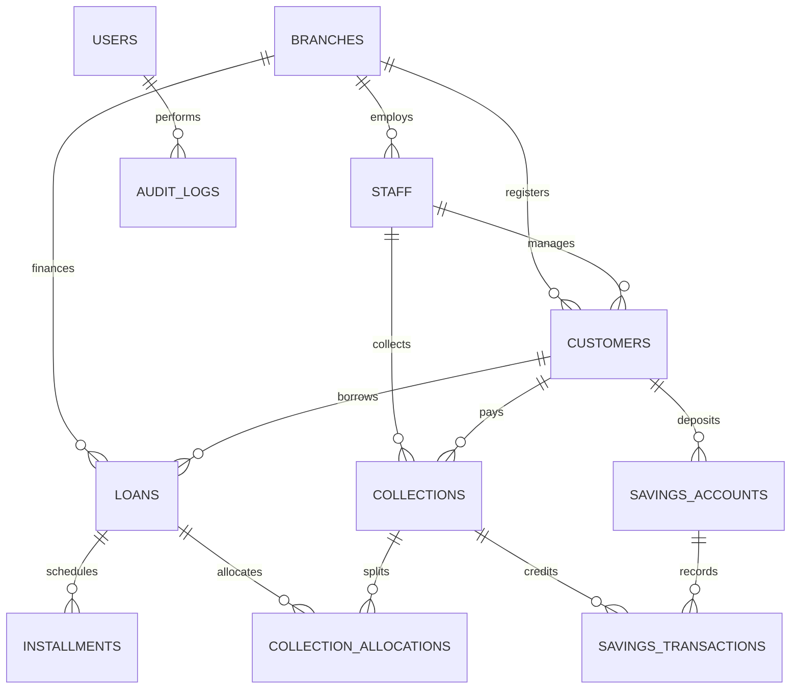

<div align="center">

# 🏛️ ASHA NGO MICROFINANCE MANAGEMENT SYSTEM
### *Enterprise Dual-Ledger Credit Portfolio, Member Savings Vault & Multi-Branch Core Banking Solution*

[](https://laravel.com)
[](https://react.dev)
[](https://www.typescriptlang.org)
[](https://tailwindcss.com)
[](#-regulatory-compliance)
[](#-financial-integrity--audit)

<br />

**Architected & Developed by [DevCenterPoint](https://devcenterpoint.com)**  
*Engineered for Microfinance Institutions (MFIs), NGOs, and Cooperative Credit Societies in Bangladesh and Emerging Markets.*

---

[🚀 Quick Start](#-step-by-step-deployment-guide) •
[📋 Scope of Work](#-scopes-of-work--delivered-architecture) •
[🛡️ Granular RBAC](#-custom-rbac--permission-matrix) •
[📊 Database & Invariants](#-database-architecture--financial-invariants) •
[🔮 Future Scaling](#-future-scaling--next-gen-roadmap)

</div>

---

## 🌟 Executive Summary & Solution Paradigm

Microfinance operations in emerging economies require stringent mathematical accuracy, offline field resilience, and multi-tiered regulatory compliance. Traditional spreadsheets and fragmented accounting software result in **ledger drift, unrecorded collections, loan delinquency, and double-billing**.

The **ASHA NGO Microfinance System** is an enterprise-grade core microcredit and member savings platform built on **immutable double-entry ledger invariants**, **atomic collection routing**, **custom Role-Based Access Control (RBAC)**, and **real-time diagnostic observability**.

```
┌────────────────────────────────────────────────────────────────────────────────────────┐
│                                DEVተCENTERPOINT CORE ENGINE                             │
├────────────────────────────┬─────────────────────────────┬─────────────────────────────┤
│   CREDIT & LOAN ENGINE     │   ATOMIC COLLECTION ROUTER  │   MEMBER SAVINGS VAULT      │
│  • Weekly Installments     │  • Dual-Ledger Allocation   │  • Voluntary Deposits       │
│  • Service Charge (Flat/%) │  • Idempotency Locking      │  • Emergency Withdrawals    │
│  • Overdue Aging Tracker   │  • Zero Double-Billing      │  • Payout Settlement        │
├────────────────────────────┴─────────────────────────────┴─────────────────────────────┤
│                          ENTERPRISE GOVERNANCE & OBSERVABILITY                         │
│  • 9-Module Custom RBAC    • Diagnostic Error Inspector  • Regulatory Audit CSV Export │
│  • User Profile & 2FA POS  • Real-time Offline Fallback  • Full Bilingual (EN / বাংলা) │
└────────────────────────────────────────────────────────────────────────────────────────┘
```

---

## 📋 Scopes of Work & Delivered Architecture

### 1. 💳 Microcredit Disbursement & Amortization Engine
* **Loan Product Lifecycles**: Supports Principal calculation, configurable NGO service charge rates (Flat/Declining), loan durations (10 to 104 weeks), and flexible repayment frequencies.
* **Granular Installment Generation**: Automatically decomposes total payable debt into atomic weekly installments with scheduled due dates, expected amounts, and individual installment tracking.
* **Delinquency & Aging Auditing**: Dynamic status classification (`active`, `overdue`, `completed`, `defaulted`) based on real-time collection reconciliation.

### 2. ⚡ Atomic Combined Collection Routing Service
* **Dual-Account Posting**: In microfinance field operations, field credit officers collect **both loan installments and weekly savings contributions in a single transaction**.
* **Database Concurrency & Locking**: The `ProcessCollectionService` utilizes database transaction locks (`DB::transaction`) to write simultaneously to:
  1. Loan installment repayment allocations (`collection_allocations`).
  2. Savings account transaction ledger (`savings_transactions`).
  3. Real-time customer profile running totals.
* **Idempotency Protection**: Enforces cryptographic `idempotency_key` verification to prevent duplicate deductions during mobile field retries or offline syncing.

### 3. 🏦 Member Savings Vault & Ledger Management
* **Dual-Account Financial Separation**: Ensures member savings are isolated from loan balances to prevent accounting commingling.
* **Voluntary & Counter Deposits**: Support for ad-hoc counter deposits, scheduled weekly savings, and emergency withdrawals with strict liquidity validations.
* **Vault Settlement**: Full account payout settlement upon member graduation or exit with automated audit trail generation.

### 4. 🛡️ Custom Role-Based Access Control (RBAC) & Permission Matrix
* **Custom Roles Engine**: Administrators can define unlimited custom institutional roles (e.g. *Senior Credit Officer*, *Branch Auditor*, *Cashier*, *Field Collector*).
* **Granular Action Matrix**: Toggles `view`, `create`, `edit`, `delete`, `approve`, `export`, and `reverse` across **9 system modules**:
  - 👥 Members & KYC (`customers`)
  - 💳 Loan Portfolio (`loans`)
  - 🏦 Savings Vault (`savings`)
  - 🧾 Collections & Receipts (`collections`)
  - 🏢 Branches (`branches`)
  - 👔 Staff & Officers (`staff`)
  - 📊 Reports & Analytics (`reports`)
  - ⚙️ System Settings (`settings`)
  - 🛡️ Activity & Error Audit (`audit`)
* **`<PermissionGate>` React Integration**: Declarative UI authorization ensuring restricted buttons and routes are completely hidden or disabled for unauthorized roles.

### 5. 👤 Comprehensive User Profile & Session Governance
* **Multi-Portal Experience**: Specialized portals for `/admin/profile`, `/staff/profile`, and `/customer/profile`.
* **Personal Contact & Branch Association**: Update official mobile phone, email, residential address, and branch assignments.
* **Role & Permissions Matrix Viewer**: Transparent breakdown of all granted vs restricted operational rights for the logged-in user.
* **Security & Biometrics**: Password updates with strength validation, Biometric POS / Quick PIN toggling for field tablets, and active session device auditing.
* **Personal Activity Trail**: Personal compliance journal documenting user-specific transactions and system events.

### 6. 🔍 System Error Log Inspector & Regulatory Activity Audit
* **Automated API Interception**: Captures every failed network request or HTTP 4xx/5xx in real time with technical stack traces and component tracing.
* **Diagnostic Inspector Modal**: Severity filters (`CRITICAL`, `API_ERROR`, `NETWORK_OFFLINE`, `VALIDATION`), stack trace viewer, and 1-click **Export JSON**.
* **Institutional Activity Journal**: Logs actor name, role, branch, entity ID, amount in BDT (৳), and timestamp with 1-click **Export CSV**.

### 7. 🌐 Dual-Engine: Live Laravel API + Offline Resilient Demo
* **Seamless API Auto-Detection**: Live backend health checker (`/api/v1/health`) dynamically toggles between real Laravel REST endpoints and seed demo data.
* **Zero Disruption**: If field connectivity drops, officers continue recording collections in memory/cache without blocking user interactions.

---

## 🗂️ Module Directory & Full CRUD Matrix

| Module | View (Read) | Add (Create) | Edit (Update) | Delete / Deactivate | Financial Invariants & Safety |
| :--- | :--- | :--- | :--- | :--- | :--- |
| **Members (KYC)** | 360 Member Profile with KYC & Loan/Savings History | Register Member Wizard with NID validation | Edit Personal, Phone, Address, Guarantor | Soft Deactivate Modal | 🚫 **Blocked if member has active loan debt > 0** |
| **Loan Portfolio** | Weekly Installment Schedule Modal | Multi-Step Credit Disbursement Wizard | Edit Loan Purpose & Guarantor Notes | Void / Cancel Uncollected Loan | 🚫 **Prevents canceling loan once installments are paid** |
| **Savings Vault** | Real-time Ledger & Transaction History | Voluntary & Counter Deposit Modal | Emergency & Maturity Withdrawal | Vault Settlement & Closure | 🚫 **Prevents overdrafts (balance cannot drop below zero)** |
| **Collections** | Printable Digital Receipt Modal | Combined Collection (Loan + Savings) | Collection Correction & Dual Rollback | Admin Void with Immutable Audit | 🚫 **Enforces idempotency keys & dual-ledger sync** |
| **Branches** | Regional Portfolio KPIs & Staff Count | Open New Operational Branch Modal | Edit Branch Name, Address, Manager | Deactivate Branch Modal | 🚫 **Verifies zero active loans before archiving branch** |
| **Staff & Officers** | Staff Profile & Assigned Routes | Appoint Field Officer Modal | Edit Staff & Custom Role Assignment | Deactivate Staff Account | 🚫 **Revokes system & POS credentials immediately** |
| **Custom RBAC** | Matrix of All Roles & Permissions | Create Custom Role Modal | Edit Granular Module Checkboxes | Delete Custom Role | 🚫 **System core roles are protected from deletion** |

---

## 📊 Database Architecture & Financial Invariants



### 🔒 Invariant Verification Script
Run the automated mathematical consistency audit anytime:
```bash
cd ngo-backend
php artisan ngo:verify-financial-integrity
```
*Output: `✓ FINANCIAL INTEGRITY VERIFIED: 100% of loan portfolios and savings vaults are mathematically consistent with immutable ledgers.`*

---

## 🚀 Step-by-Step Deployment Guide

### 📋 Prerequisites
* **Operating System**: Linux (Ubuntu 22.04 LTS / Debian 12 / AlmaLinux 9) or Windows Server
* **PHP**: `PHP 8.2` or `8.3` with extensions: `php-bcmath`, `php-ctype`, `php-curl`, `php-dom`, `php-fileinfo`, `php-json`, `php-mbstring`, `php-openssl`, `php-pcre`, `php-pdo`, `php-sqlite3`/`php-mysql`, `php-tokenizer`, `php-xml`
* **Web Server**: `Nginx` (Recommended) or `Apache`
* **Node.js**: `Node.js 20+` LTS & `npm` / `pnpm`
* **Database**: `SQLite` (Default zero-config) or `MySQL 8.0+` / `PostgreSQL 16+`

---

### 1️⃣ Backend Setup (Laravel 11)

```bash
# Clone the repository
git clone https://github.com/devcenterpoint/ngo-microfinance-system.git
cd ngo-microfinance-system/ngo-backend

# Install production PHP dependencies
composer install --no-dev --optimize-autoloader

# Create environment configuration
cp .env.example .env

# Generate application cryptographic key
php artisan key:generate

# Configure database & run migrations with seed data
php artisan migrate --seed

# Run financial integrity verification test suite
php artisan test
php artisan ngo:verify-financial-integrity

# Optimize configuration and route caching
php artisan config:cache
php artisan route:cache
php artisan view:cache
```

#### Production `.env` Snippet:
```env
APP_NAME="ASHA NGO Microfinance"
APP_ENV=production
APP_DEBUG=false
APP_URL=https://ngo.yourdomain.com

DB_CONNECTION=sqlite
# Or for MySQL:
# DB_CONNECTION=mysql
# DB_HOST=127.0.0.1
# DB_PORT=3306
# DB_DATABASE=ngo_microfinance
# DB_USERNAME=ngo_user
# DB_PASSWORD=your_secure_password

CORS_ALLOWED_ORIGINS=https://ngo.yourdomain.com
```

---

### 2️⃣ Frontend Setup (React 19 + Vite)

```bash
cd ../ngo-frontend

# Install JavaScript dependencies
npm install

# Configure production API endpoint
echo "VITE_API_URL=https://ngo.yourdomain.com/api/v1" > .env.production

# Build optimized production bundle
npm run build
```
*The compiled assets will be ready in `dist/`.*

---

### 3️⃣ Production Nginx Server Configuration

Create `/etc/nginx/sites-available/ngo-system.conf`:

```nginx
server {
    listen 80;
    server_name ngo.yourdomain.com;
    return 301 https://$host$request_uri;
}

server {
    listen 443 ssl http2;
    server_name ngo.yourdomain.com;

    ssl_certificate /etc/letsencrypt/live/ngo.yourdomain.com/fullchain.pem;
    ssl_certificate_key /etc/letsencrypt/live/ngo.yourdomain.com/privkey.pem;

    # Frontend Single Page Application (SPA)
    root /var/www/ngo-system/ngo-frontend/dist;
    index index.html;

    location / {
        try_files $uri $uri/ /index.html;
    }

    # Backend API Routing (Laravel)
    location ^~ /api {
        alias /var/www/ngo-system/ngo-backend/public;
        try_files $uri $uri/ @laravel;

        location ~ \.php$ {
            include snippets/fastcgi-php.conf;
            fastcgi_param SCRIPT_FILENAME /var/www/ngo-system/ngo-backend/public/index.php;
            fastcgi_pass unix:/var/run/php/php8.2-fpm.sock;
        }
    }

    location @laravel {
        rewrite ^/api/(.*)$ /api/index.php last;
    }

    # Security Headers
    add_header X-Frame-Options "SAMEORIGIN";
    add_header X-XSS-Protection "1; mode=block";
    add_header X-Content-Type-Options "nosniff";
    client_max_body_size 20M;
}
```

Enable the site and reload Nginx:
```bash
sudo ln -s /etc/nginx/sites-available/ngo-system.conf /etc/nginx/sites-enabled/
sudo nginx -t && sudo systemctl reload nginx
```

---

### 4️⃣ Docker & Containerization Blueprint

A complete `docker-compose.yml` for containerized environments:

```yaml
version: '3.8'

services:
  ngo-backend:
    image: php:8.2-fpm-alpine
    container_name: ngo_backend
    restart: unless-stopped
    working_dir: /var/www/html
    volumes:
      - ./ngo-backend:/var/www/html
    environment:
      APP_ENV: production
      APP_DEBUG: "false"

  ngo-web:
    image: nginx:alpine
    container_name: ngo_web
    restart: unless-stopped
    ports:
      - "80:80"
      - "443:443"
    volumes:
      - ./ngo-frontend/dist:/var/www/frontend
      - ./ngo-backend:/var/www/backend
      - ./nginx.conf:/etc/nginx/conf.d/default.conf
    depends_on:
      - ngo-backend
```

---

## 🔮 Future Scaling & Next-Gen Roadmap

DevCenterPoint has architected this system to scale horizontally from local single-branch NGOs to national multi-region federations:

### 1. 📱 Offline-First PWA & Android Native Field POS (Q3 2026)
- **Local SQLite / WatermelonDB sync**: Field officers can collect installments in deep rural areas with zero internet connectivity.
- **Bluetooth Thermal Receipt Printing**: Instant physical thermal receipts printed via handheld Bluetooth ESC/POS printers.
- **Biometric Fingerprint Authentication**: Integrated with Bangladesh National ID (NID) biometric smart card readers.

### 2. 📲 Automated MFS Webhook Gateway (bKash, Nagad, Rocket) (Q4 2026)
- **Direct Borrower Self-Payment**: Members can pay weekly dues directly via bKash Merchant API or Nagad QR code.
- **Webhook Reconciliation**: Automatic ledger posting upon instant payment notification with zero manual cashier intervention.

### 3. 🤖 AI Credit Scoring & Delinquency Predictor (Q1 2027)
- **Repayment Probability Modeling**: Machine learning algorithms analyzing member savings regularity, community guarantor trust networks, and historical repayment cycles.
- **Early Warning System**: Automated alerts for credit officers when a borrower exhibits behavioral signs of loan delinquency.

### 4. 🏛️ Automated MRA Regulatory XML/JSON Compliance Bridge (Q2 2027)
- **Microcredit Regulatory Authority (MRA) Automated Submission**: One-click generation and cryptographic signing of MRA Form-1 to Form-8 quarterly compliance filings.

---

## 👨‍💻 Engineering Standards & Anti-Drift Contract

To ensure longevity and maintainability, this project follows the strict **DevCenterPoint Living Contract Protocol**:
1. **Never diverge code and documentation**: Before altering financial rules, schema, or API routes, documentation is inspected and updated.
2. **Immutable Double-Entry Accounting**: Ledger entries are additive and atomic; destructive updates to balance fields without corresponding journal rows are strictly prohibited.
3. **Automated Continuous Verification**: `php artisan test` and `php artisan ngo:verify-financial-integrity` run on every CI/CD push.

---

<div align="center">

### Crafted with Precision by [DevCenterPoint](https://devcenterpoint.com)
*Transforming Non-Profit & Microfinance Governance Through Intelligent Software Architecture.*

**Inquiries & Commercial Customization**: [contact@devcenterpoint.com](mailto:contact@devcenterpoint.com)  
**Website**: [https://devcenterpoint.com](https://devcenterpoint.com)

© 2026 DevCenterPoint. All rights reserved.

</div>
