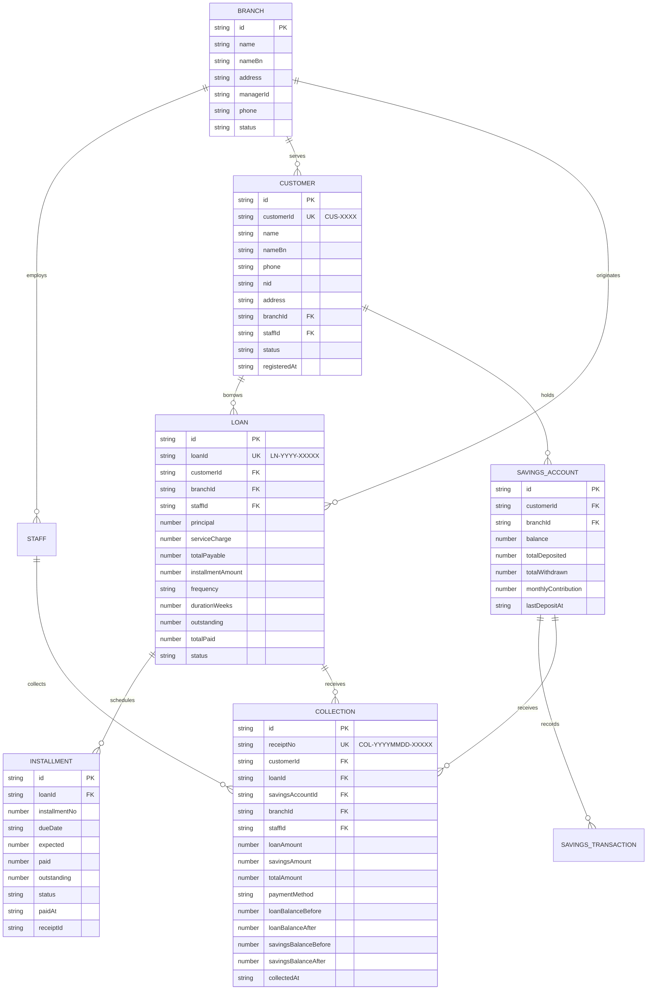

# 04 — Database & Entity Design

## 1. Relational Entity Schema

```mermaid
erDiagram
    BRANCH ||--o{ STAFF : employs
    BRANCH ||--o{ CUSTOMER : serves
    BRANCH ||--o{ LOAN : originates
    CUSTOMER ||--o{ LOAN : borrows
    CUSTOMER ||--o{ SAVINGS_ACCOUNT : holds
    LOAN ||--o{ INSTALLMENT : schedules
    LOAN ||--o{ COLLECTION : receives
    SAVINGS_ACCOUNT ||--o{ SAVINGS_TRANSACTION : records
    SAVINGS_ACCOUNT ||--o{ COLLECTION : receives
    STAFF ||--o{ COLLECTION : collects

    BRANCH {
        string id PK
        string name
        string nameBn
        string address
        string managerId
        string phone
        string status
    }

    CUSTOMER {
        string id PK
        string customerId UK "CUS-XXXX"
        string name
        string nameBn
        string phone
        string nid
        string address
        string branchId FK
        string staffId FK
        string status
        string registeredAt
    }

    LOAN {
        string id PK
        string loanId UK "LN-YYYY-XXXXX"
        string customerId FK
        string branchId FK
        string staffId FK
        number principal
        number serviceCharge
        number totalPayable
        number installmentAmount
        string frequency
        number durationWeeks
        number outstanding
        number totalPaid
        string status
    }

    INSTALLMENT {
        string id PK
        string loanId FK
        number installmentNo
        string dueDate
        number expected
        number paid
        number outstanding
        string status
        string paidAt
        string receiptId
    }

    SAVINGS_ACCOUNT {
        string id PK
        string customerId FK
        string branchId FK
        number balance
        number totalDeposited
        number totalWithdrawn
        number monthlyContribution
        string lastDepositAt
    }

    COLLECTION {
        string id PK
        string receiptNo UK "COL-YYYYMMDD-XXXXX"
        string customerId FK
        string loanId FK
        string savingsAccountId FK
        string branchId FK
        string staffId FK
        number loanAmount
        number savingsAmount
        number totalAmount
        string paymentMethod
        number loanBalanceBefore
        number loanBalanceAfter
        number savingsBalanceBefore
        number savingsBalanceAfter
        string collectedAt
    }
```
