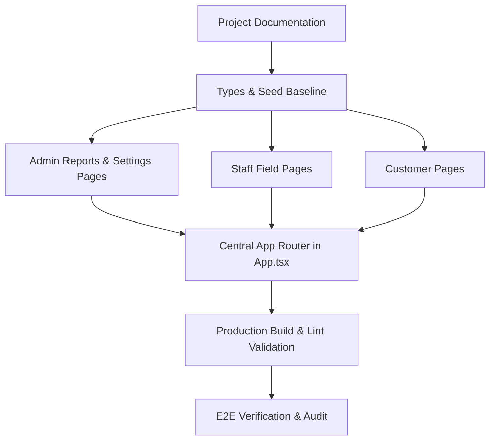

# 14 — Dependency Graph

```mermaid
graph TD
    DOCS[Project Documentation] --> TYPES[Types & Seed Baseline]
    TYPES --> ADMIN_PAGES[Admin Reports & Settings Pages]
    TYPES --> STAFF_PAGES[Staff Field Pages]
    TYPES --> CUST_PAGES[Customer Pages]
    ADMIN_PAGES --> ROUTER[Central App Router in App.tsx]
    STAFF_PAGES --> ROUTER
    CUST_PAGES --> ROUTER
    ROUTER --> BUILD[Production Build & Lint Validation]
    BUILD --> QA[E2E Verification & Audit]
```
