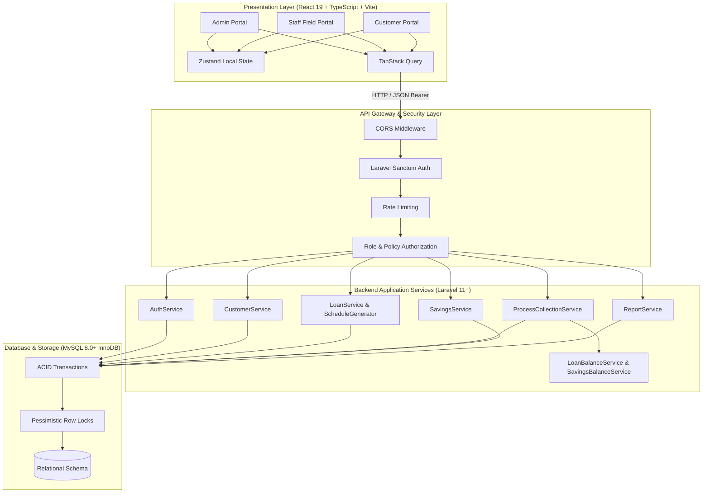

# SYSTEM ARCHITECTURE & INTEGRATION

## 1. High-Level System Architecture



---

## 2. Directory & Namespace Structure

```
ngo-backend/
├── app/
│   ├── DTO/
│   │   ├── CollectionDTO.php
│   │   ├── LoanDisbursementDTO.php
│   │   └── CustomerRegistrationDTO.php
│   ├── Http/
│   │   ├── Controllers/
│   │   │   └── Api/
│   │   │       └── V1/
│   │   │           ├── AuthController.php
│   │   │           ├── DashboardController.php
│   │   │           ├── CustomerController.php
│   │   │           ├── LoanController.php
│   │   │           ├── DueController.php
│   │   │           ├── CollectionController.php
│   │   │           ├── SavingsController.php
│   │   │           ├── BranchController.php
│   │   │           ├── StaffController.php
│   │   │           ├── ReportController.php
│   │   │           └── SettingsController.php
│   │   ├── Requests/
│   │   │   ├── StoreCollectionRequest.php
│   │   │   ├── StoreCustomerRequest.php
│   │   │   └── StoreLoanRequest.php
│   │   └── Resources/
│   │       ├── CustomerResource.php
│   │       ├── LoanResource.php
│   │       ├── CollectionResource.php
│   │       └── SavingsAccountResource.php
│   ├── Models/
│   │   ├── Branch.php
│   │   ├── User.php
│   │   ├── Customer.php
│   │   ├── Loan.php
│   │   ├── LoanInstallment.php
│   │   ├── SavingsAccount.php
│   │   ├── SavingsTransaction.php
│   │   ├── Collection.php
│   │   ├── CollectionAllocation.php
│   │   ├── AuditLog.php
│   │   └── OrgSetting.php
│   ├── Policies/
│   │   ├── CustomerPolicy.php
│   │   ├── LoanPolicy.php
│   │   └── CollectionPolicy.php
│   └── Services/
│       ├── ProcessCollectionService.php
│       ├── LoanScheduleGenerator.php
│       ├── LoanBalanceService.php
│       ├── SavingsBalanceService.php
│       └── ReceiptNumberService.php
```
