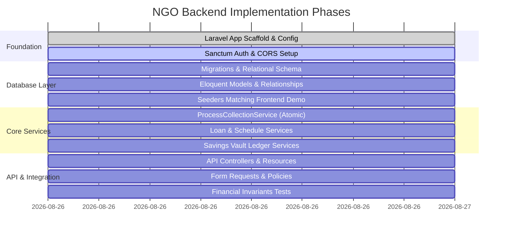

# BACKEND IMPLEMENTATION PLAN

## 1. Phased Delivery Roadmap

---

## 2. Dependency Order of Module Implementation

1. **`branches`** & **`users`** (Auth, Staff, Roles)
2. **`customers`** (KYC, Members, Branch Linkages)
3. **`savings_accounts`** & **`savings_transactions`** (Vault Ledger)
4. **`loans`** & **`loan_installments`** (Disbursement & 50-Week Schedule)
5. **`collections`** & **`collection_allocations`** (`ProcessCollectionService` with row locking & atomic rollback)
6. **`audit_logs`** & **`org_settings`**
7. **Dashboard & Report Aggregators**
8. **Automated Test Suite (Financial Invariants FI-01 through FI-13)**
