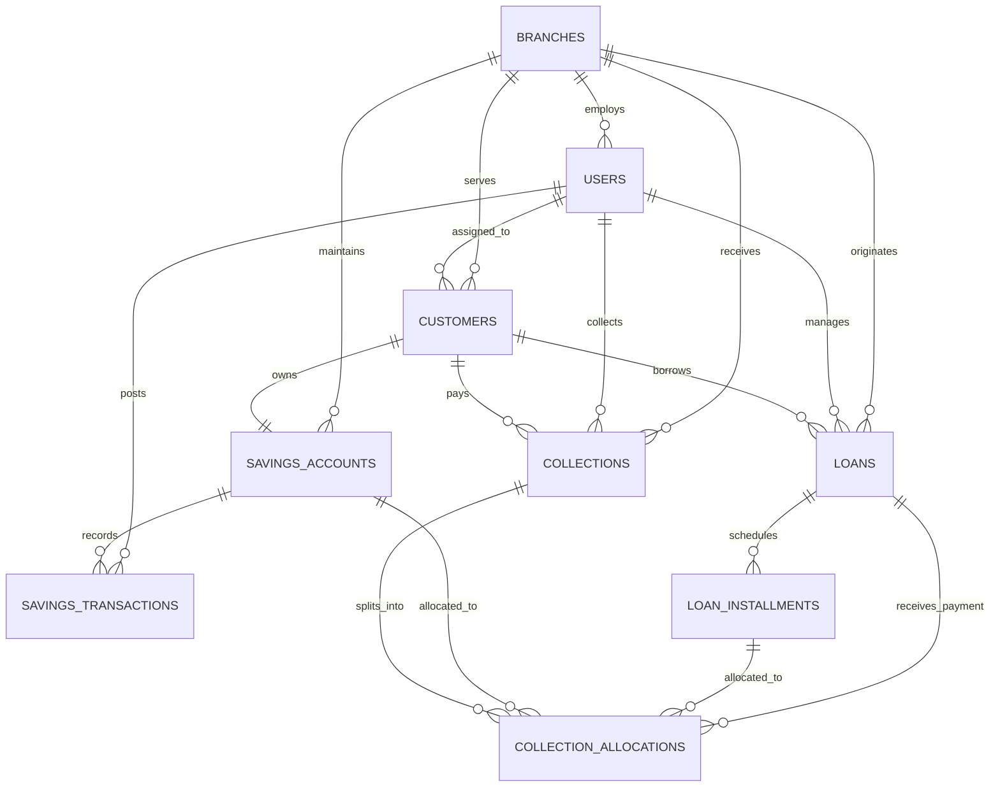

# DATABASE ARCHITECTURE & SPECIFICATION

## 1. Engine & Technical Parameters

- **Database Management System**: MySQL 8.0+
- **Default Storage Engine**: `InnoDB`
- **Default Collation**: `utf8mb4_unicode_ci`
- **Monetary Data Type**: `DECIMAL(15,2)`
- **Timezone**: Application & Query Standard `Asia/Dhaka` (UTC+6), Database stored as UTC timestamps.
- **Foreign Key Constraints**: Strict `RESTRICT` on delete for critical financial records (`loans`, `installments`, `collections`, `savings_transactions`).

---

## 2. Relational Schema Structure

---

## 3. Core Database Tables Summary

1. `branches` — Operational branch offices.
2. `users` — Authentication accounts, staff members, branch managers, administrators.
3. `customers` — Microfinance members, KYC profiles, NID, phone numbers.
4. `loans` — Credit contracts, principal, service charge, total payable, weekly installments, cache counters.
5. `loan_installments` — Weekly payment schedule, due dates, expected amounts, status flags.
6. `savings_accounts` — Member savings vaults, weekly targets, cached balances.
7. `savings_transactions` — Append-only immutable savings transaction ledger.
8. `collections` — Point-in-time receipt records, total amounts, staff linkages, idempotency keys.
9. `collection_allocations` — Normalized bridge allocating collection portions to loan installments and savings accounts.
10. `audit_logs` — Institutional audit trail recording state changes and actor context.
11. `org_settings` — Organization legal identity, MRA registration, helpline, branding.
