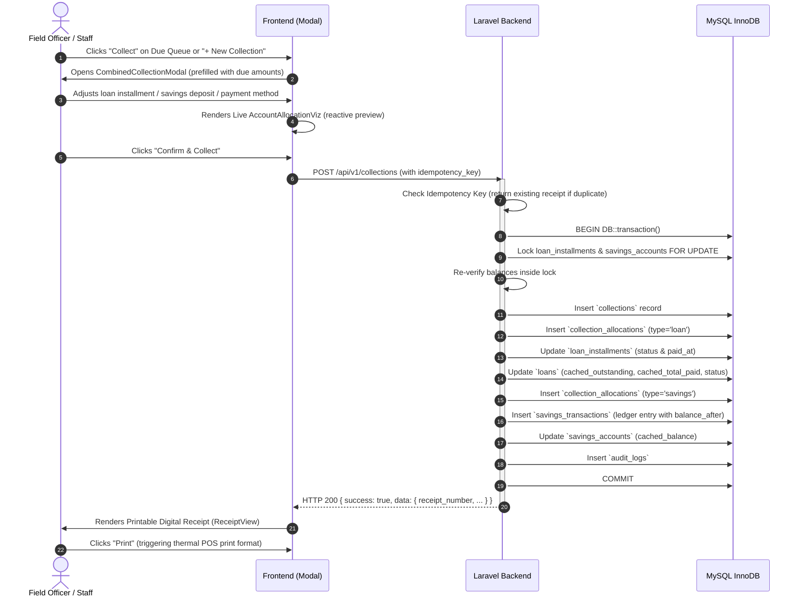

# FRONTEND WORKFLOWS

## 1. The Combined Collection Workflow (Core Operational Path)



---

## 2. Member Onboarding & KYC Registration

```
Admin/Staff Opens "Register New Member" Modal
  ↓
Enters: Full Name, বাংলা নাম, Mobile (01XXXXXXXXX), NID (10/13/17 digits), Address, Branch, Assigned Officer, Occupation
  ↓
Client-side Zod validation passes
  ↓
POST /api/v1/customers
  ↓
Backend creates customer (generating CUS-XXXX code) and automatically initializes empty SavingsAccount
  ↓
Returns created member record
  ↓
Frontend updates table and dispatches toast notification
```

---

## 3. Loan Origination & Schedule Generation (3-Step Wizard)

```
Step 1: Select Eligible Member (search by name, phone, or customerId)
  ↓
Step 2: Define Loan Parameters (Principal ৳5k-৳500k, Service Charge 1-30%, Duration 10-104 wks, Start Date, Purpose)
  ↓
Live Schedule Math:
  - Service Charge = (Principal * Rate) / 100
  - Total Payable = Principal + Service Charge
  - Installment Amount = Total Payable / Weeks
  ↓
Step 3: Review & Schedule Inspection
  ↓
Confirm & Disburse -> POST /api/v1/loans
  ↓
Backend generates loan record (LN-2026-XXXXX) + 50 weekly `loan_installments` rows inside transaction
  ↓
Returns created loan & schedule
```

---

## 4. Savings Direct Deposit & Withdrawal Workflow

```
Admin Opens Savings Page -> Clicks "Record Withdrawal" or "+ Direct Deposit"
  ↓
Selects Member Account, specifies Amount & Purpose Note
  ↓
Validation: Withdrawal cannot exceed current account balance (FI-02)
  ↓
POST /api/v1/savings/{id}/deposit OR POST /api/v1/savings/{id}/withdraw
  ↓
Backend locks savings_account FOR UPDATE, creates `savings_transactions` row, updates `cached_balance` atomically
  ↓
Returns updated account ledger
```
